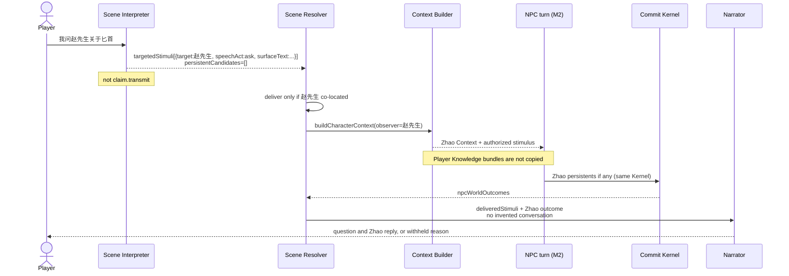

# M0 — Chat-first Scene Turn Contract

Status: frozen architecture / contract for #57

Baseline: `main = 2e3e47a6d563149715c5e9eb33cf61a7ec14c4d1`

Stage owner: #55

Evidence: #52, #53, #54

North Star: preserve freeform chat roleplay; Engine constrains long-term consequences in the background.

Invariant: **Engine constrains consequences, not imagination.**

This document freezes the smallest non-authoritative Scene Turn contract. It does not change Production Runtime. M1 may implement from this document without another broad architecture review.

## 1. Verdict

The Authority core is intact and must stay intact. The product failure is above the Kernel:

```text
Player message
→ choose one of seven actor Proposal APIs
→ Hard Validator / Commit
→ Narrator explains
```

That path treats Engine-supported effects as a Player-action permission list. Real play then substitutes legal movement for negation, cannot eat, converts a question into `claim.transmit`, and advances World time on every raw line.

The correction is a Scene layer that resolves a natural contribution first, then sends only future-causal effects through the existing Kernel.

Do not:

- infer Truth from Narrator prose;
- copy Player-private Context into an NPC Context;
- rewrite the Kernel / Validator / Event model;
- build a generic Action/Effect DSL;
- build a full Dialogue / Memory / Scheduler platform;
- add Food / Inventory so `吃饭` can succeed.

## 2. Current runtime responsibility map

Exact code at `2e3e47a`. This is the as-is map, not the target map.

```text
CLI line (src/play.ts)
  → TurnOrchestrator.runActorTurn(player)          // LLM Simulation
      ContextBuilder.buildCharacterContext(player)
      SimulationAdapter.generate({ context, intent }) → { proposals[] }
      bind worldId / revision / occurredAt / causeEventIds=[]
      CommitKernel.commit each proposal
  → runWorldContinuation()                         // always, after every non-empty line
      rotate NPC A/B/C
      maybe authored NPC-B relationship.change
      local continuation model: optional claim.transmit + world.time_advance +10min
      CommitKernel
      maybe delayed consequence Claim + Player learn_claim
  → NarrativeEnvelopeBuilder.build(player TurnResult only)
  → Narrator.generate
```

### 2.1 `src/play.ts` — mixed application / scenario / runtime

| Responsibility | Current owner | Should belong to |
|---|---|---|
| readline CLI, `:quit`, blank skip | `runPlayableLocalLoop` | application shell |
| `DWE_LLM_*` / `DWE_WORLD_FILE` | `readConfig` | application shell |
| SQLite open / seed / resume | `openOrSeedWorld` | application shell |
| terminal sanitization, status print | `sanitizeTerminalText`, `printWorldStatus` | application shell |
| Closed Inn character / Claim ids | `ids` | scenario policy |
| observer-scoped `displayText` map | `closedInnClaimGroundings` | scenario policy |
| NPC rotation by time-advance count | `runWorldContinuation` | scenario policy |
| unconditional `+10 minutes` | `createClosedInnContinuationModel` | scenario policy (must lose the unconditional coupling) |
| authored NPC-B delayed `relationship.change` | `commitAuthoredNpcReaction` | scenario policy |
| delayed observer Claim / Knowledge | `ensureDelayedConsequence` | scenario policy |
| Player LLM vs local continuation orchestrators | `runPlayableLocalLoop` | application wiring |
| compose Player + NPC/world outcomes for Narrator | **missing** — envelope uses Player `TurnResult` only | Scene Resolver (new) |
| time / continuation gated on resolved scene | **missing** — every non-empty line continues the world | Scene Resolver (new) |

`src/play.ts` is a successful vertical proof. It is not the product architecture.

### 2.2 `src/engine/context-builder.ts`

- Read-only observer Context. Correct Visibility Gate.
- Supplies: World envelope, observer Character, location, `movementOptions`, co-located public characters, observer Knowledge bundles, observer-as-source relationships, packing stats.
- Packs by Claim id, then co-located characters, then relationships; slices by budget. No relevance.
- No recent resolved scene, no current utterance, no last NPC reply, no summary, no memory.
- `displayText` is applied only after CharacterKnowledge visibility.

Keeps this job. M1/M2 may *add* optional observer-safe fields; they must not leak Fact or other-character Knowledge.

### 2.3 `src/engine/simulation-adapter.ts`

- Input: already-filtered `CharacterContext` + actor id + intent.
- Output: `{ proposals: CandidateProposal[] }` of exactly seven actor types.
- Empty list is legal and currently means inaction.
- Repair is schema/authority only. No entailment, negation, ephemeral beat, or targeted utterance.
- Does not read Store or call Commit.

This is the primary drift point. M1 evolves this boundary into Scene interpretation. It must not become a second write path.

### 2.4 `src/engine/turn-orchestrator.ts`

- Builds observer Context, calls Simulation, prevalidates the whole proposal list, binds trusted Event envelope, commits in order through Kernel.
- `{ proposals: [] }` → `status: "empty"`, zero writes.
- Stale retry, proposal cap, actor ownership, partial-prefix semantics are correct and stay.

Keep as the persistent-proposal executor. Do not teach it natural language.

### 2.5 `src/engine/commit-kernel.ts` / `validator.ts` / `projector.ts` / `candidate.ts`

Authority core. Candidate → Zod → Hard Validator → SQLite transaction → Event → Projection → revision.

Actor models cannot emit `fact.assert`. Trusted scenario producers already submit authored Candidates through the same Kernel.

**No rewrite. No NL in Hard Validator. No second commit API.**

### 2.6 `src/engine/narrative.ts`

- Envelope = Player intent + Player `TurnResult.status` + rebuilt Player Context + Player committed outcomes + safe rejection kind/code.
- Empty Turn instructions: narrate observation or inaction. No successful ephemeral lane.
- NPC/world continuation outcomes are not in the envelope, so Narrator cannot faithfully report them.
- Narrator is read-only. Output is never parsed back into state. Keep that.

### 2.7 Scenario / testkit

`src/testkit/world-builder.ts` `seedClosedInnWorld()` is a test fixture whose goals revolve around the dagger. `npm run play` uses it as the product world. That explains dagger fixation. Closed Inn remains the regression / playtest scene; it is not a generic original-world product.

`tests/playable-local-loop.test.ts` proves CLI, HTTP, resume, Kernel and delayed causality with a loopback provider. It is not a real-model intent-fidelity proof. Its fake player plan still maps many lines onto `character.move` / `claim.transmit`, and every line currently forces `+10 minutes`.

## 3. Target responsibility map

| Layer | Owns | Must not own |
|---|---|---|
| Application shell | CLI, env, SQLite session, provider wiring, terminal safety | world rules, NPC scripts, Truth writes |
| Scene Interpreter | non-authoritative `SceneTurnPlan` from Player contribution + legal Context | Kernel commit, NPC private Context, Fact writes |
| Scene Resolver | lane routing, ephemeral approval, stimulus delivery bookkeeping, time gating, compose `ResolvedSceneEnvelope` | a second DB write path |
| Persistent executor | existing Turn Orchestrator + Commit Kernel for `persistentCandidates` | scene prose, ephemeral success, NL entailment |
| Target NPC response (M2) | NPC Context + authorized current stimulus + NPC persistents through Kernel | Player-private Knowledge, other NPC private speech |
| Narrator | player-facing prose from `ResolvedSceneEnvelope` | Truth, Knowledge grants, hidden state |
| Context continuity (M3; tiny window from M1) | recent resolved scenes after Visibility | overwriting Fact / Claim / Knowledge / Event |
| Scenario policy | Closed Inn ids, authored reactions, optional NPC continuation, `displayText` | generic Scheduler, product-wide time coupling |

## 4. Minimal Scene Turn contract

Two records exist. Only the second may mention committed Truth, and only by pointing at Kernel Events.

### 4.1 `SceneTurnPlan` — non-authoritative interpretation

Produced by the Scene Interpreter from:

- raw Player contribution (unmodified string);
- Player observer `CharacterContext`;
- optional recent resolved-scene window (M1: last 1–3 scenes, in-process is enough).

```text
SceneTurnPlan
  playerContribution: string          # raw input; never rewritten as Truth
  channel: in_world | ooc_meta
  ephemeralBeats: EphemeralBeat[]
  targetedStimuli: TargetedStimulus[]
  persistentCandidates: CandidateProposal[]   # existing seven actor types only
  unsupportedMaterial: UnsupportedMaterial[]
  timePolicy: none | consume_scene_time{ minutes: positive int }
```

```text
EphemeralBeat
  summary: string                     # Narrator color for this turn only
  # no locationId, no claimId, no relationship deltas, no item ids
  # summary is not structured Truth and is not Interpreter entailment evidence

TargetedStimulus
  speakerCharacterId: string          # must equal the Player actor
  targetCharacterId: string           # must be a co-located public character in Player Context
  surfaceText: string                 # exact authorized utterance, not Player-private analysis
  speechAct: ask | tell | other
  persistence: ephemeral | durable_if_future_causal   # M1 ignores durable; treat as ephemeral

UnsupportedMaterial
  attempted: string
  reason: not_entailed | material_without_primitive | illegal_in_context | ambiguous
  playerFacing: clarification | bounded_failure | no_effect
```

Authority class of every `SceneTurnPlan` field: **non-authoritative**. The plan is interpretation. It cannot be replayed as Truth. Snapshot changes require Kernel Events.

`persistentCandidates` reuse the current seven actor Proposal types and actor-ownership rules. No Action enum expansion. No generic Effect DSL. `fact.assert` remains unavailable to this model. M1 Resolver **ignores** `persistence: durable_if_future_causal` (treat as ephemeral). Do not persist speech in M1.

### 4.2 `ResolvedSceneEnvelope` — Narrator / continuity input

Built by the Scene Resolver **after** Kernel commits and after any same-process NPC/world continuation that the resolved scene allowed.

```text
ResolvedSceneEnvelope
  playerContribution: string
  channel: in_world | ooc_meta
  observerContext: CharacterContext          # Player observer, rebuilt after commits
  approvedEphemeralBeats: EphemeralBeat[]
  deliveredStimuli: TargetedStimulus[]       # passed co-location + visibility
  withheldStimuli: { stimulus, reason }[]
  committedEffects: NarrativeOutcomeProjection[]    # Player Kernel Events only
  rejectedEffects: { kind, code }[]
  npcWorldOutcomes: NarrativeOutcomeProjection[]    # continuation Kernel Events
  unsupportedMaterial: UnsupportedMaterial[]
  timePolicy: TimePolicy
  timeCommitted: boolean
  continuationRan: boolean
  turnStatus: empty | success | rejected | partial | stale | ephemeral_success | ooc
```

`committedEffects` and `npcWorldOutcomes` that enter the Player envelope must pass the Player Visibility Gate. Do not attach other-character Knowledge bundles, other-character `currentGoal` / identity, or relationship rows where `sourceCharacterId !== player`. A continuation Event the Player did not participate in and cannot Know is omitted, or reduced to a public fact the Player can already see (co-location, alive).

Narrator may describe only this envelope. It must not claim:

- a persistent effect that is absent from visibility-legal `committedEffects` / `npcWorldOutcomes`;
- elapsed World time unless `timeCommitted === true`;
- a conversation whose stimulus is in `withheldStimuli` or missing from `deliveredStimuli`;
- an NPC reply that has no corresponding NPC outcome / response field;
- completion of `unsupportedMaterial`.

If an ephemeral `summary` would describe a denylisted persistent that is not in those visibility-legal outcomes, drop the beat (do not parse the string for meaning: drop when persistents were stripped/rejected or the snapshot gate fails). Mixed legal persistents are described from `committedEffects`, not from the beat.

Narrator output is never parsed back into Candidates, Events, Facts, Claims, Knowledge, or Memory-as-Truth. Envelope beat summaries are also not entailment evidence for later persistents.

### 4.3 Deterministic resolver rules

These are code rules, not prompt hopes. Order: channel gate → lane strips → Kernel.

1. **Single write path.** Scene Resolver may call existing `CommitKernel.commit` / Turn Orchestrator execution only. No Store insert, no snapshot mutation, no new commit function. No World table for Plan or Envelope. M2 durable stimulus, if any, is a Kernel Candidate/Event or it does not exist.
2. **OOC channel.** If the raw contribution has a leading `/ooc` (optional surrounding whitespace), Resolver sets `channel=ooc_meta` even when the Interpreter said `in_world`. If `channel === "ooc_meta"`: drop persistents, stimuli, ephemeral beats, and timePolicy; do not run continuation; `timeCommitted = false`. Unprefixed meta complaints remain Interpreter classification; that residual is not this hard gate. Do not put Chinese OOC detection in Hard Validator.
3. **Entailment default.** If the Interpreter is uncertain, `persistentCandidates` must be `[]`. Unrelated legal actions are forbidden. This is an Interpreter contract; Hard Validator stays legality-only. Recent-window text is not entailment evidence.
4. **Ephemeral snapshot gate.** After commits, any Materialized field that has no matching committed Event of that kind must equal the pre-scene snapshot (location without `character.move`, alive without `character.die`, Knowledge/Claims without `learn_claim` / `claim.record` / `claim.transmit`, relationships without `relationship.change`). Time may change only via the resolver-minted `world.time_advance`. If this gate fails: do not approve beats; fail toward `rejected` / `unsupportedMaterial`; do not narrate success.
5. **Material denylist for ephemeral beats.** An ephemeral beat cannot complete: death; permanent injury; location change; important item transfer / possession; relationship change; Fact / Claim / Knowledge change; permission / lock / access; tracked resource consumption; World time. Enforcement is the snapshot gate plus dropping beats when persistents were stripped/rejected — not NL parsing of `summary`. Resolver never mints a Candidate from `EphemeralBeat.summary` or Narrator text.
6. **Time is not a raw-line side effect.** `world.time_advance` is committed **if and only if** `timePolicy.kind === "consume_scene_time"` and `channel !== "ooc_meta"`. Resolver mints that single Candidate (`toTime = currentTime + minutes`) and **drops every `world.time_advance` present in `persistentCandidates`**, including continuation output. Continuation must not emit time. If `timePolicy.kind === "none"`: `timeCommitted = false`. `minutes` is a positive integer with M1 cap `1..60`; default meal tick is 10. `occurredAt` for non-time persistents remains authoritative `World.currentTime`. Scene Resolver must not stamp `timePolicy.minutes` onto other Candidate types.
7. **Stimulus visibility.** A stimulus is delivered only if the target is in the speaker's co-located public characters. Delivery copies `surfaceText`, speaker id, speechAct and persistence flag — never Player Knowledge bundles, `currentGoal`, identity internals, or unmentioned Claims. `surfaceText` is prompt stimulus, not CharacterKnowledge: delivery does not insert Claims, Knowledge rows, or `displayText`. Do not redact the Player's uttered words (that would be a Dialogue platform). Constrain the **write**, not the chat surface.
8. **Ask is not a Knowledge write.** If `targetedStimuli` contains `speechAct=ask` and contains no `speechAct=tell`: drop `claim.transmit`, `character.learn_claim`, and `claim.record` from Player `persistentCandidates` before Kernel; do not rewrite the stimulus into those types. M1 stops after delivery bookkeeping and must not invent an NPC reply. If `speechAct=tell` is present, `claim.transmit` may remain only when it already appears in `persistentCandidates`; Resolver does not infer transmit from `surfaceText`. Hearing an ask does not grant Knowledge. M2 NPC persistents after a delivered `ask` use the same drop unless that NPC's own turn explicitly tells from NPC Context.
9. **Unsupported material.** No false success in ephemeral beats or Narrator. No unrelated persistent substitution. **M1 Scene Resolver always drops Player `claim.record`** before Kernel. Utterances are not Claims. Trusted Closed Inn producers may still `claim.record` outside Scene Interpreter. `claim.transmit` of an already-known Claim remains available only with `speechAct=tell`.
10. **NPC Context isolation.** NPC turns call `ContextBuilder.buildCharacterContext({ observerCharacterId: npcId })`. Player Context is not an input.
11. **Scenario producers stay Kernel clients.** `ensureDelayedConsequence` / authored NPC reaction are Closed Inn policy, not Scene Interpreter output. M1 must not call them on `ooc_meta` or `timeCommitted=false` turns unless a prior in-world Event already satisfies their existing predicates (they already no-op without a trigger). Do not add new `claim.record` from Scene.

## 5. Ephemeral / Persistent / Targeted boundaries

| Lane | Scene success? | Kernel write? | Survives process resume? | Typical examples |
|---|---|---|---|---|
| Ephemeral beat | yes | no | no; beats die with the process and are not stored in the M1 window | eat a normal meal, sit, look around, wipe rain, refuse a plan in place |
| Targeted stimulus (ephemeral) | yes, as current-scene speech | no | no | greeting, a question answered this turn |
| Targeted stimulus (`durable_if_future_causal`) | yes | M1 ignores (treat as ephemeral). M2 may add one Kernel Event | yes, only if M2 commits that Event | a question the NPC must still answer after restart |
| Persistent candidate | only if Kernel accepts | yes, existing chain | yes, via Event Log | move, transmit a known Claim, relationship change, time advance |
| Unsupported material | no | no | n/a | steal a locked object with no primitive, kill through ephemeral prose |
| OOC / meta | not a scene | no | n/a | complain about the system, correct the model, `:quit` remains CLI |

`tell` of a known Claim is persistent (`claim.transmit`) when entailed. `ask` is not a Claim grant and not automatic `claim.transmit`.

Selective persistence (ADR-010, R6): do not persist every chat line. M1 does not persist speech. M2 persists a stimulus only when it still has future causal value.

## 6. Time and continuation

Raw message count is not World time.

```text
raw CLI line
  ≠ in-world scene action
  ≠ consume_scene_time
  ≠ NPC continuation
  ≠ world.time_advance
```

Resolver-enforced time rules are only §4.3.2 (`/ooc` / `ooc_meta` → `none`) and §4.3.6 (mint time iff remaining `timePolicy` is `consume_scene_time`; drop Interpreter `world.time_advance`). The table below is the Interpreter contract plus fake-model tests. Do not put Chinese intent classification into the Resolver.

| Contribution | timePolicy | Continuation |
|---|---|---|
| leading `/ooc`, or Interpreter `ooc_meta` | `none` (forced) | no |
| `我不想去找匕首` / remain in place | `none` | no |
| `我只是看看周围` | `none` | no |
| `我想吃饭` | `consume_scene_time` minutes=10 (meal takes time; still no Food state) | NPC continuation may run **without** emitting time |
| entailed `character.move` | `none` unless Interpreter also set consume; move does not mint a second tick; `occurredAt` stays current World time | no automatic time Event |
| question already co-located | `none` | M1: no NPC reply. M2 may run the target NPC response as part of the scene, not as a generic scheduler tick |

Closed Inn's current continuation model always emits `world.time_advance + 10 minutes`. That coupling is scenario-policy debt. M1 must remove it. Delayed-consequence tests that depended on “every line = +10 minutes” must be rewritten around resolved `timePolicy`, not preserved.

World-continues-without-player (Constitution 2.8) remains valid, but continuation is a resolved-scene decision, not a stdin-line decision.

## 7. End-to-end sequences

### 7.1 Mundane ephemeral action — `我想吃饭`

```mermaid
sequenceDiagram
  actor Player
  participant CLI as Application shell
  participant SI as Scene Interpreter
  participant SR as Scene Resolver
  participant K as Commit Kernel
  participant N as Narrator

  Player->>CLI: 我想吃饭
  CLI->>SI: raw contribution + Player Context
  SI-->>SR: channel=in_world<br/>ephemeralBeats=[eat ordinary meal]<br/>persistentCandidates=[]<br/>timePolicy=consume_scene_time
  SR->>K: world.time_advance only
  K-->>SR: committed time Event
  Note over SR,K: snapshot location/knowledge/relationships unchanged
  SR->>N: ResolvedSceneEnvelope<br/>approvedEphemeralBeats + timeCommitted
  N-->>Player: meal portrayed; no Food/Inventory
```

Failure mode this kills: empty Turn → “no action” / dagger exposition, or unrelated `character.move`.

### 7.2 Direct Player→NPC question — `我问赵先生关于匕首`



M1 must produce the plan, strip Knowledge primitives on ask-only, and must not substitute `claim.transmit`. M1 sequence **ends** at delivered/withheld stimulus. The NPC participant in the diagram is M2-only. Envelope shows delivered stimulus and must not invent Zhao's answer. M2 completes the NPC response path.

### 7.3 Mixed scene with one persistent effect

`我走到赵先生身边，问他关于失踪匕首的事情。` while Player is in 客栈大堂 and Zhao is there, or while Player must move.

```mermaid
sequenceDiagram
  actor Player
  participant SI as Scene Interpreter
  participant SR as Scene Resolver
  participant Orch as Turn Orchestrator
  participant K as Commit Kernel
  participant N as Narrator

  Player->>SI: move + ask in one message
  SI-->>SR: persistentCandidates=[character.move?]<br/>targetedStimuli=[ask 赵先生]<br/>timePolicy=consume_scene_time
  alt move entailed and legal
    SR->>Orch: execute persistentCandidates
    Orch->>K: character.move
    K-->>SR: committedEffects=[move]
  else already co-located
    Note over SR: no move candidate
  end
  SR->>K: world.time_advance iff timePolicy consumes; drop Interpreter time proposals
  SR->>SR: deliver ask stimulus after location is current
  Note over SR: still not claim.transmit
  SR->>N: committed move (if any) + delivered ask + no false Claim tell
  N-->>Player: both the walk (iff committed) and the question
```

One message may occupy several lanes. That is why the contract is a plan of lanes, not a single API pick.

## 8. Evidence matrix

| Player contribution | Contract result |
|---|---|
| `我不想去找匕首` | `channel=in_world`; negation preserved as ephemeral remain-in-place / refusal; `persistentCandidates=[]`; no `character.move`; `timePolicy=none` |
| `我只是看看周围` | ephemeral observation beat; no movement; `timePolicy=none` |
| `我想吃饭` | ephemeral meal success; no Food/Inventory/Item; optional `consume_scene_time` via Kernel; location/knowledge unchanged |
| unsupported material action | `unsupportedMaterial` set; no false ephemeral completion; no unrelated legal Proposal |
| `我问赵先生关于匕首` | `targetedStimuli.speechAct=ask`; Resolver drops `claim.transmit` / `learn_claim` / `claim.record` when there is no `tell`; Zhao does not receive Player-private Context |
| action + speech in one message | both lanes represented; only entailed persistents commit; no Action enum explosion |
| OOC correction / complaint | `channel=ooc_meta`; no persistents; no ten World minutes; no continuation |
| NPC/world continuation | runs only after an allowed in-world resolved scene; outcomes appear in `npcWorldOutcomes`; Narrator cannot hide a missing NPC Event |

#52 and #54 are M1 acceptance evidence. #53 is the M2 blocker. They are not three independent patches.

## 9. Kernel remains; migration path

### 9.1 Why the Kernel is not rewritten

| Need | Existing mechanism |
|---|---|
| Refuse unrelated movement | do not emit `character.move`; empty persistents already commit nothing |
| Eat without Food state | ephemeral lane; Constitution §4 already excludes ordinary eating from Persistent State |
| Advance time | `world.time_advance` Candidate, already Kernel-validated |
| Transmit a known Claim | `claim.transmit` unchanged |
| NPC authored reaction | trusted producer → same Kernel (already in `play.ts`) |
| Resume / replay | Event Log + projector; ephemeral is not in the log, by design |
| Visibility | Context Builder unchanged as the gate |

Hard Validator stays deterministic legality. It does not grow Player-intent parsing.

### 9.2 Allowed later Kernel *addition* (not M1)

M2 may add **one** narrow durable-stimulus Candidate/Event if in-memory speech cannot survive resume when the utterance still has future causal value. That Event still goes through Commit Kernel. If it is not a Kernel Event, it does not exist. No second commit function. No non-Kernel store. Do not implement durable stimulus as `claim.record`.

It is not a Dialogue Framework, not a speech-act ontology, and not a Kernel rewrite. M1 must not add it. M1 ignores `durable_if_future_causal`.

### 9.3 Simulation Adapter evolution

Replace actor-facing `{ proposals: [] }` as the *only* model product with `SceneTurnPlan`. Do not keep a compatibility parser that treats seven-type Proposal lists as the Player surface.

Turn Orchestrator keeps executing `CandidateProposal[]`. Scene Resolver extracts `persistentCandidates` plus resolver-bound time Events and passes those into the existing execution path.

Existing fake-provider tests that look for “top-level `{proposals:[...]}`” and that treat every line as a move/tick must change in M1. Do not preserve that product behavior.

## 10. `src/play.ts` split plan

Do not explode the file in M0. Split in the slices that need the boundary.

### M1 — smallest extraction

New modules, names may change:

- `src/engine/scene-turn.ts` — types for `SceneTurnPlan` / `ResolvedSceneEnvelope`;
- `src/engine/scene-interpreter.ts` — evolved model JSON boundary (from Simulation Adapter);
- `src/engine/scene-resolver.ts` — deterministic lane routing, time gate, envelope composition.

`src/play.ts` still owns CLI, session, Closed Inn policy, but **must call Scene Resolver instead of raw `runActorTurn` + unconditional continuation**. Continuation’s automatic `world.time_advance` is deleted.

### M2 — scenario out of the shell

Move Closed Inn ids, claim groundings, authored reaction, delayed consequence and NPC rotation into `src/scenario/closed-inn/`. Application shell only opens a world session and a scene loop.

### Later

CLI / config / terminal sanitization may move to `src/app/` when the scene loop is stable. Not a prerequisite for M1.

Stop rule for the split: if a file split is required before one ephemeral case works, skip the split and keep the new types beside `play.ts` until the vertical case is green.

## 11. Context continuity minimum (not a Memory platform)

M1 window may store, after Visibility:

- `playerContribution`
- `channel`
- committed Event **types and ids** (Player + visibility-legal npc/world)
- `deliveredStimuli.surfaceText` for stimuli the observer was a speaker or target of
- `unsupportedMaterial.attempted` / `reason`
- `timeCommitted`, `turnStatus`

M1 window must **not** store `approvedEphemeralBeats.summary` as Interpreter input or as justification for later persistents. Beats remain Narrator-only color for the current turn, then die with the process.

| Stage | Window | Storage | Selection |
|---|---|---|---|
| M1 | the ring buffer above (last 1–3 scenes) | in-process is enough | chronological, after Visibility |
| M2 | same, plus current authorized stimulus on the target NPC Context | durable Kernel Event only if M2 proves resume needs it | Visibility then target match |
| M3 | five layers in `CHAT_FIRST_PRODUCT_RESET.md` §8 | SQLite non-Truth window + optional rolling summary | Visibility, then relevance/recency, then budget |

Memory / summary never overwrite Fact, Claim, CharacterKnowledge or Event history. Relevance may omit legal information; it may never add illegal information. Envelope text is not Truth and is not entailment evidence.

M1 does not build RAG, vector DB, summarizer, or Continuity v1's five-layer stack.

## 12. Targeted Build-vs-Borrow

No new market scan. Apply the already-recorded research:

| Borrow | Do not copy |
|---|---|
| Chat as the only required surface | SillyTavern Prompt Manager / Lorebook as user-facing setup |
| Layered context: essentials + recent + relevant recall | Summary / Memory as Truth |
| Optional `/say` `/do` `/ooc` later as disambiguation (R10) | Mandatory Do/Say/Story UI before free chat works |
| Observation vs planning vs persistence as separate jobs | Generative Agents always-on 25-NPC scheduler |

Dongfang-specific piece: independent authoritative state + per-character Visibility + Kernel commit. That is why SceneTurnPlan sits *above* the Kernel instead of replacing it with a prompt stack.

## 13. Targeted Authority red-team

Attack surface is the Scene layer, not a Kernel rewrite. Round 1 failed because several “code rules” were still Interpreter hopes (`timePolicy` OR-clause, ask-only Knowledge primitives, beat summaries re-fed as entailment, a non-Kernel M2 store). Round 2 patches those into resolver exclusions (§4.3). Residual risk that remains accepted is listed last.

| Attack | Result | Mitigation |
|---|---|---|
| Ephemeral beat claims a location change | Blocked at write | snapshot gate: location unchanged without committed `character.move`; beat dropped on mismatch; `summary` is not parsed |
| Ephemeral beat claims death / item / relationship / Knowledge | Blocked at write | same per-field snapshot gate |
| Narrator writes a move that Kernel rejected | Forbidden | visibility-legal outcomes only; `timeCommitted` required to claim elapsed time |
| Parse final prose back into Candidates | Forbidden | no prose→Candidate path; beat summaries are not next-turn entailment evidence |
| NPC turn receives Player Context object | Forbidden | NPC Context rebuilt for NPC observer only |
| `surfaceText` names a secret the Player uttered | Allowed as speech | constrain the **write**: ask-only strips `claim.transmit` / `learn_claim` / `claim.record`; delivery inserts no Knowledge |
| `ask` auto-grants Zhao the cellar Claim | Forbidden | resolver strip on ask-only; Kernel never sees those persistents |
| `claim.record` used as a chat log | Forbidden | M1 Scene Resolver always drops Player `claim.record`; M2 durable stimulus is a Kernel Event, not `claim.record` |
| OOC line still ticks +10 minutes | Forbidden for `/ooc` prefix and Interpreter `ooc_meta` | prefix override + drop time candidates; unprefixed Chinese meta remains Interpreter residual |
| Continuation model still always `time_advance` | Forbidden in M1 | continuation must not emit time; resolver drops any such candidate |
| `timePolicy=none` but persistents contain `world.time_advance` | Forbidden | time Event iff consume_scene_time; persistents' time proposals are dropped |
| SceneTurnPlan stored as Materialized State | Forbidden | plan/envelope are not World tables |
| Second write API beside Kernel | Forbidden | Kernel only; §9.2 non-Kernel store struck |
| Soft/NL checks inside `validator.ts` | Forbidden | Hard Validator stays legality |
| Eating creates hunger/food rows | Forbidden | no schema for Food |
| Trusted Closed Inn producer bypasses Kernel | Already illegal | still Kernel; not invoked on OOC / no-time turns without an existing trigger |

Accepted residual:

- A real model may still emit an **unrelated** legal persistent (negation → `character.move`). M1 fights that with the plan contract, fake-model regressions, and a real-model smoke — not Hard Validator NL.
- Unprefixed OOC Chinese (`系统你搞错了`) may be labeled `in_world` by the Interpreter. `/ooc` is the deterministic override; do not call unprefixed detection a hard gate.
- If the Player's uttered `surfaceText` itself tells a secret, that is Player speech, not a Context copy. Writes remain stripped on ask-only.
- A dummy `speechAct=tell` with a matching `claim.transmit` is the same class of Interpreter residual as unrelated movement. M1 does not add NL to detect dummy tell. Fake-model tests cover ask-only (no tell). Real-model smoke records remaining substitutions.

`ask` → `claim.transmit` is **not** the same residual as unrelated movement. It is closed by the ask-only Knowledge strip, not by prompt wording.

Red-team conclusion after the §4.3 patches: no Authority bypass is required, and no prose→Truth inference is required. Stop Rule is not triggered. M1 must implement the resolver strips, not only the Interpreter schema.

## 14. Frozen M1 Issue

Create this Issue as the only implementation entry after M0 merges. Do not implement #52 or #54 as standalone patches.

**Title:** `M1: Intent-faithful Scene Turn + Ephemeral lane`

**Parent:** #55 (M1). Evidence/AC from #52 and #54.

**Exact start point:** the `main` SHA that contains this contract.

### Scope

- Implement `SceneTurnPlan` / `ResolvedSceneEnvelope` types and Scene Interpreter JSON boundary.
- Route `npm run play` Player input through Scene Resolver.
- Approve ephemeral success without Event/Materialized State (except optional `world.time_advance` when `timePolicy` consumes time).
- Fail toward no persistent effect on negation, observation, unsupported material, and questions.
- Stop treating `{ proposals: [] }` as the only representation of a successful mundane action.
- Gate World time and Closed Inn continuation on the resolved scene; remove unconditional `+10 minutes` per raw line.
- Feed Narrator `ResolvedSceneEnvelope` so Player ephemeral beats and explicit NPC/world outcomes are visible; do not infer them from prose.
- Update deterministic tests, including Playable Local Loop’s time coupling.
- Keep Kernel, Validator, Event types, Visibility Gate and replay unchanged.

### Out of scope

- NPC reply path / durable utterance Event (#53, M2);
- Memory / RAG / vector DB / rolling summary (M3);
- generic Action/Effect DSL;
- Food / Hunger / Inventory;
- Scheduler;
- World Pack Compiler;
- UI;
- Kernel rewrite;
- full `play.ts` file split beyond the smallest Scene modules;
- a new formal real-model sample unless the Slice’s own AC requires one opt-in smoke.

### Acceptance

Deterministic fake-model / injected-provider tests:

1. `我不想去找匕首` commits no `character.move`; location unchanged.
2. `我只是看看周围` commits no movement; envelope contains an observation ephemeral beat.
3. `我想吃饭` commits no Food/Inventory/Item; envelope contains a meal ephemeral beat; snapshot location/knowledge/relationships unchanged; time may advance only via `world.time_advance` if `timePolicy` consumes time.
4. A question to 赵先生 (`speechAct=ask`, no `tell`) does not commit `claim.transmit`, `character.learn_claim`, or `claim.record`, even if the Interpreter emitted them. Fake-model tests must inject those persistents and prove the Resolver strips them.
5. Unsupported material produces `unsupportedMaterial` and no false success in envelope or Narrator input.
6. Leading `/ooc` and Interpreter `ooc_meta` commit nothing and do not advance World time, including when persistents contain `world.time_advance`.
7. Mixed move+speech still allows an entailed legal `character.move` when the contribution requests movement.
8. Persistent commits still go through Kernel and remain replayable.
9. Existing authority / repair / schema / replay tests remain green except those that encoded “empty = inaction” or “every line = +10 minutes”, which are updated rather than compatibility-wrapped.
10. Narrator envelope for a Player turn that only eats does not include a move outcome.
11. Injected `world.time_advance` with `timePolicy=none` is dropped; World clock unchanged.
12. M1 recent window does not include `approvedEphemeralBeats.summary`.
13. Injected Player `claim.record` on eat / look / ask / OOC is dropped; no new Claim row.

Opt-in real-model smoke (not CI, no reroll for prettier prose): the same five natural inputs must not produce unrelated movement or Food state.

### Tests to add or rewrite

- `tests/engine/scene-turn-*.test.ts` for schema, `/ooc` override, snapshot gate, ask-only Knowledge strip, `timePolicy=none` dropping `world.time_advance`.
- Update `tests/engine/narrative.test.ts` empty-Turn case: observation may be `ephemeral_success`, not only `empty`.
- Update `tests/playable-local-loop.test.ts` so delayed consequence depends on resolved time-consuming scenes, not raw line count.
- Keep Closed Inn harness / Canon tests green.

### Stop rule

Stop and escalate if the only viable M1 design requires: prose as Truth; Player-private Context on NPCs; replacing Commit Kernel; a generic DSL; persisting every chat line; Food/Inventory; or a Memory/Dialogue/Scheduler platform.

## 15. What M0 deliberately does not freeze

- Exact TypeScript file names beyond the M1 suggestion.
- NPC reply generation details (M2).
- Durable stimulus schema (M2).
- Relevance ranking algorithm (M3).
- Whether a user-visible `/ooc` hint is documented in the CLI banner (the resolver override itself is frozen: a leading `/ooc` is OOC). Default remains one chat box.
- Closed Inn replacement as the default product world.

## 16. Key decisions

1. **Scene interpretation is a new non-authoritative layer, not a Kernel feature.** Persistent writes stay Candidate → Validator → Transaction → Event → Projection.
2. **Three player-facing lanes plus OOC and unsupported-material.** That is enough for the evidence matrix. No DSL.
3. **Empty persistent list is no longer equal to failure.** Ephemeral success and delivered speech are first-class.
4. **Time is a resolved-scene persistent effect.** Raw stdin lines do not tick the world. `world.time_advance` is minted iff `consume_scene_time`; Interpreter time proposals are dropped.
5. **Ask is not a Knowledge write.** Resolver strips `claim.transmit` / `learn_claim` / `claim.record` on ask-only turns. M2 delivers the NPC response from NPC Context.
6. **`src/play.ts` is split by milestone, not as a rewrite prelude.** M1 extracts Scene types/resolver and deletes unconditional continuation time.
7. **Playable Local Loop tests lose the line-count time coupling.** That is product-correct, not a compatibility break to preserve.
8. **One later Kernel addition is allowed in M2** (durable stimulus as a Kernel Event, or it does not exist). Still not a rewrite. Not `claim.record`.
